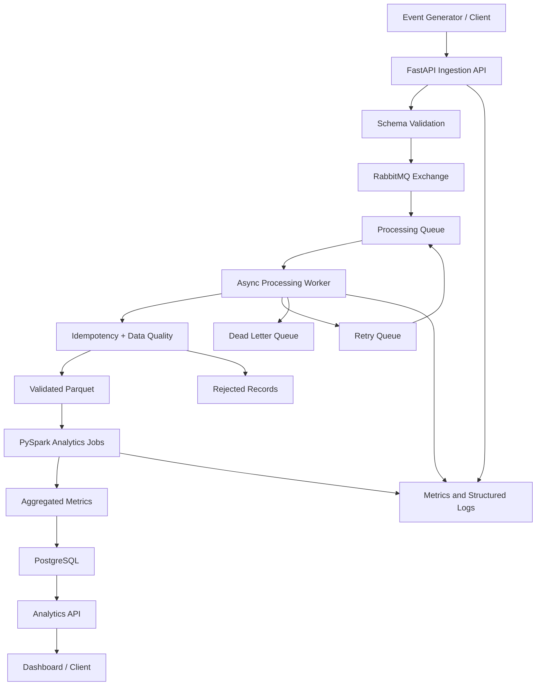
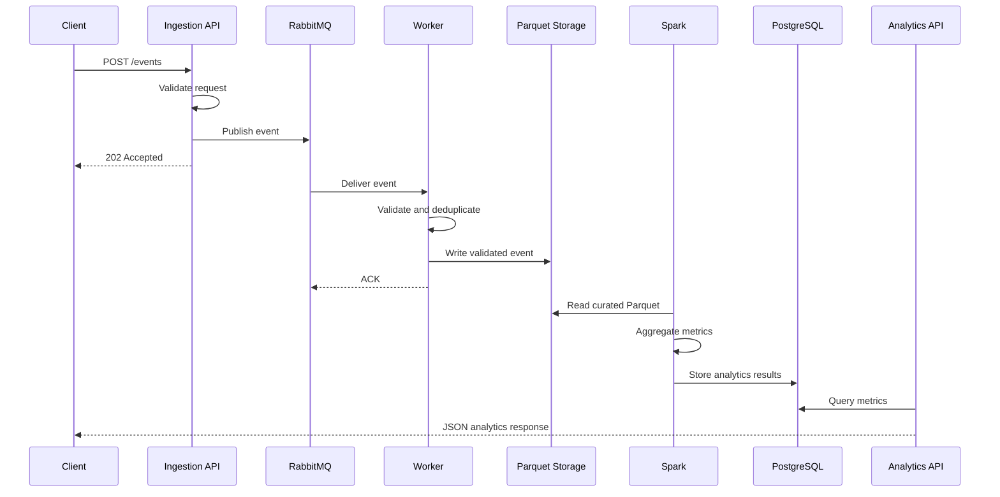

# PulseStream

**PulseStream** is a production-style, end-to-end communication analytics platform designed to demonstrate real-time backend engineering, distributed messaging, reliable event processing, and large-scale data analytics.

It simulates communication events such as SMS, WhatsApp, email, voice, and push notifications. Events are ingested through an asynchronous FastAPI service, published to RabbitMQ, processed by an idempotent worker, stored as partitioned Parquet data, and analyzed using PySpark/Spark SQL. Aggregated results are exposed through an analytics API.

> **Portfolio goal:** demonstrate the engineering skills commonly requested for backend, real-time communication, distributed systems, cloud, testing, and data-processing roles.

---

## 1. What this project demonstrates

### Backend and distributed systems

- Asynchronous FastAPI ingestion
- RabbitMQ-based decoupling
- Durable queues, retry handling, and dead-letter queues
- Idempotent event processing
- Duplicate detection
- Structured logging
- Health endpoints
- Prometheus-style metrics
- PostgreSQL-backed analytics results
- Redis-ready caching boundary

### Data engineering and analytics

- Event schema validation
- Data-quality reporting
- Invalid-record isolation
- Partitioned Parquet storage
- PySpark and Spark SQL transformations
- Delivery-rate analytics
- p50/p95/p99 latency analytics
- Regional and channel-level aggregations
- Customer usage analytics
- Benchmarking hooks

### Testing and reliability

- Unit tests with pytest
- Integration tests for the Spark pipeline
- Failure and retry test boundaries
- Load-test starter using Locust
- GitHub Actions CI
- Docker Compose development environment

---

## 2. Architecture



### Component responsibilities

| Component | Responsibility |
|---|---|
| Ingestion API | Accept and validate events, publish messages quickly |
| RabbitMQ | Buffer and distribute asynchronous work |
| Processing worker | Validate, deduplicate, enrich, and persist events |
| Data-quality layer | Isolate malformed or invalid records |
| Parquet data lake | Store analytical event data efficiently |
| Spark jobs | Compute aggregate communication metrics |
| PostgreSQL | Serve query-friendly aggregate results |
| Analytics API | Expose metrics to clients |
| Tests and CI | Verify correctness and prevent regressions |

---

## 3. Event lifecycle



---

## 4. Repository structure

```text
PulseStream/
├── README.md
├── LICENSE
├── pyproject.toml
├── requirements.txt
├── .env.example
├── docker-compose.yml
├── Makefile
│
├── services/
│   ├── ingestion/
│   │   └── main.py
│   ├── processor/
│   │   └── worker.py
│   └── analytics_api/
│       └── main.py
│
├── src/pulsestream/
│   ├── models.py
│   ├── validation.py
│   ├── deduplication.py
│   ├── storage.py
│   └── metrics.py
│
├── spark_jobs/
│   └── aggregate_metrics.py
│
├── scripts/
│   ├── generate_events.py
│   ├── run_spark_job.py
│   └── benchmark.py
│
├── tests/
│   ├── unit/
│   ├── integration/
│   └── load/
│
├── data/
│   ├── raw/
│   ├── validated/
│   ├── rejected/
│   ├── curated/
│   └── reports/
│
├── docs/
│   ├── SYSTEM_DESIGN.md
│   ├── DATA_MODEL.md
│   └── TESTING_STRATEGY.md
│
└── .github/workflows/ci.yml
```

---

## 5. Quick start

### Prerequisites

- Python 3.11+
- Docker Desktop
- Java 11 or 17 for local Spark
- Git

### Create the environment

```bash
python -m venv .venv
```

Windows:

```powershell
.venv\Scripts\activate
```

Linux/macOS:

```bash
source .venv/bin/activate
```

Install dependencies:

```bash
pip install -r requirements.txt
```

Start infrastructure:

```bash
docker compose up -d rabbitmq postgres
```

Generate sample data:

```bash
python scripts/generate_events.py --count 10000 --output data/raw/events.jsonl
```

Run the Spark analytics job:

```bash
python scripts/run_spark_job.py
```

Run tests:

```bash
pytest -q
```

Start the ingestion API:

```bash
uvicorn services.ingestion.main:app --reload --port 8000
```

Start the analytics API:

```bash
uvicorn services.analytics_api.main:app --reload --port 8001
```

API documentation:

- Ingestion API: `http://localhost:8000/docs`
- Analytics API: `http://localhost:8001/docs`
- RabbitMQ management: `http://localhost:15672`

Default RabbitMQ credentials:

```text
username: pulsestream
password: pulsestream
```

---

## 6. Example API request

```bash
curl -X POST http://localhost:8000/events \
  -H "Content-Type: application/json" \
  -d '{
    "event_id": "evt_demo_001",
    "customer_id": "cust_001",
    "message_type": "sms",
    "region": "ap-south-1",
    "event_timestamp": "2026-09-17T10:30:00Z",
    "status": "delivered",
    "latency_ms": 125,
    "payload_bytes": 640,
    "error_code": null
  }'
```

Expected behavior:

1. The API validates the event.
2. The event is published to RabbitMQ.
3. The API returns `202 Accepted`.
4. A worker can process the event asynchronously.

---

## 7. Data-quality rules

The validation layer rejects or isolates events when:

- `event_id` is missing
- `customer_id` is missing
- `message_type` is unsupported
- `status` is unsupported
- `latency_ms` is negative
- `payload_bytes` is negative
- timestamp parsing fails
- required fields are null

Duplicate events are ignored after the first successful processing attempt.

---

## 8. Analytics produced

The Spark job computes:

- Total event count
- Delivered event count
- Failed event count
- Delivery rate
- Average latency
- p50 latency
- p95 latency
- p99 latency
- Message volume by type
- Message volume by region
- Customer-level message counts
- Failure counts by error code

---

## 9. Testing strategy

### Unit tests

Unit tests cover:

- Schema validation
- Invalid statuses
- Negative values
- Latency buckets
- Delivery-rate calculations
- Duplicate detection
- Partition path generation

### Integration tests

Integration tests cover:

- Event generation
- JSONL ingestion
- Spark transformation
- Parquet output
- Aggregate correctness

### Load testing

A Locust starter is included under `tests/load/locustfile.py`.

Suggested experiments:

- 100 concurrent clients
- 500 concurrent clients
- Single-event versus batch ingestion
- Queue backlog under worker slowdown
- Spark performance across 10K, 100K, and 1M events

---

## 10. Suggested future extensions

- Replace RabbitMQ with Kafka for partitioned event streaming
- Add HDFS as an alternative storage target
- Add Airflow orchestration
- Add Prometheus and Grafana dashboards
- Add Redis caching for analytics endpoints
- Add Kubernetes manifests
- Add exactly-once sink semantics
- Add schema evolution with a registry
- Add a Streamlit dashboard

---


## 11. Engineering notes

This repository is intentionally designed to be runnable on a modest development laptop. The default workflow uses local Parquet and local Spark. HDFS, Kafka, Airflow, and Kubernetes are extension paths rather than mandatory local dependencies.
